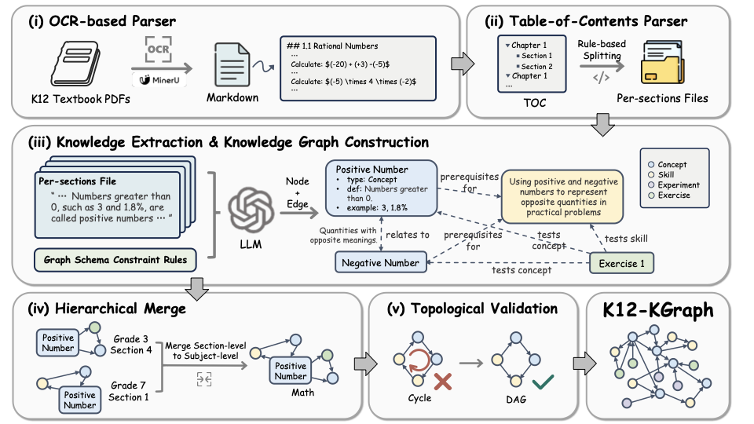
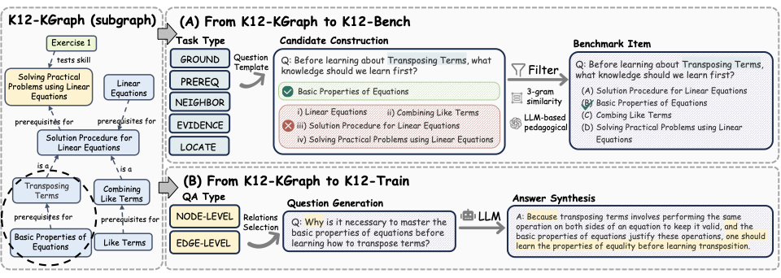
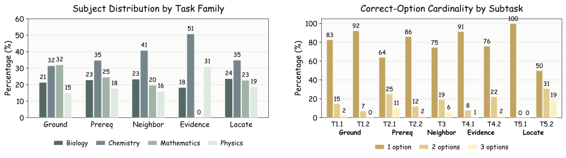

<div align="center">

<a href="https://haolpku.github.io/K12-KGraph-page/">
  
</a>

<h1>K12-KGraph</h1>

<p><b>面向教育大模型评测与训练的课程对齐知识图谱</b></p>

<p>
  <a href="https://huggingface.co/datasets/lhpku20010120/K12-KGraph">
    
  </a>
  <a href="https://haolpku.github.io/K12-KGraph-page/">
    
  </a>
  <a href="#-引用">
    
  </a>
  <a href="LICENSE">
    
  </a>
</p>

<p>
  
  
  
  
  
  
</p>

<p>
  <sub>
    数据源自人民教育出版社（PEP）中国 K–12 官方教材。
    K12-KGraph 将同一科学对象在 <b>定义</b>、<b>公式</b>、<b>实验</b>、<b>习题</b>、<b>教材位置</b>、<b>关系邻域</b> 六个维度上进行结构化对齐。
  </sub>
</p>

<p>
  🌐 <a href="https://haolpku.github.io/K12-KGraph-page/"><b>访问可交互项目主页 →</b></a>
</p>

</div>

---

## 🌟 为什么需要 K12-KGraph？

当下主流大模型能够回答"勾股定理是什么"，但它缺少 **课程认知** —— 无法回答：

- 🧭 *这个概念的前置条件是什么？*
- 🔬 *哪个实验可以验证它？*
- 📝 *哪些习题在考察它？*
- 📚 *它在教材的哪一章哪一节？*
- 🕸 *它在概念分类体系中的位置？*

K12-KGraph 是**首个**开源、多学科、以官方教材为基底、把上述 5 个维度在同一张图谱上对齐的 STEM 知识图谱。它直接衍生出两个即插即用的 AI 资源：

| | [K12-Bench](https://huggingface.co/datasets/lhpku20010120/K12-KGraph) | [K12-Train](https://huggingface.co/datasets/lhpku20010120/K12-KGraph) |
|---|---|---|
| **规模** | 23,640 道多选题 | 2,267 条 SFT QA |
| **作用** | 评测课程结构认知能力 | 通过 KG-guided SFT 传授课程认知 |
| **任务族 / 合成来源** | Ground · Prereq · Neighbor · Evidence · Locate | 节点属性合成 + 关系模板合成 + 确定性模板 |
| **关键结论** | 即使 Gemini-3-Flash 也只达到 **57.1%** EM | 在 2,300 条样本预算下超过 8 个主流 SFT 语料 |

---

## 📊 K12-Bench Leaderboard（zero-shot，单位 %）

| 模型 | Overall EM | Overall F1 |
|---|---|---|
| *Random guess* | 6.7 | 36.4 |
| Meta-LLaMA-3-8B-Instruct | 7.2 | 52.6 |
| GLM-4.7-Flash | 31.7 | 63.9 |
| GPT-4o | 31.1 | 65.9 |
| Qwen3-32B | 42.6 | 69.5 |
| Gemma-4-31B-IT | 46.4 | 69.5 |
| GPT-5.2 | 42.8 | 68.0 |
| Gemini-2.5-Flash | 48.3 | 66.7 |
| **Gemini-3-Flash** | **57.1** | **73.0** |

> 即使最强的闭源模型，在 **Prereq（前置推理）** 和 **Neighbor（邻居推荐）** 两个任务上仍有超过 40% 的题目做不对。完整 5 任务细分结果请见 [项目主页](https://haolpku.github.io/K12-KGraph-page/)。

---

## 🗺️ 仓库结构

```
K12-Dataset/
├── src/
│   ├── kg/          # 知识图谱构建流程
│   ├── benchmark/   # K12-Bench 题目合成
│   ├── sft_qa/      # K12-Train QA 合成（节点 / 关系 grounded）
│   └── utils/       # 共享配置 / LLM client / IO
├── eval/            # K12-Bench 评测脚本（OpenAI 兼容 / vLLM）
├── config/          # 默认 pipeline 配置
├── demo/            # 数据格式示例（精简版）
├── books.yaml       # 教材注册清单
├── docs/img/        # README 图片
└── requirements.txt
```

构建流水线：

```
PDF 教材 ─► MinerU 解析 ─► 按节切分 ─► GPT-5.2 schema 约束抽取
         ─► 分层合并（书 → 学科 → 全局）─► DAG 校验 + 专家复核
         ─► K12-KGraph ─► K12-Bench（图查询）+ K12-Train（QA 合成）
```

---

## 🚀 快速开始

### 1. 安装

```bash
git clone https://github.com/haolpku/K12-Dataset.git
cd K12-Dataset
pip install -r requirements.txt
```

> 如果需要从 PDF 启动完整 pipeline，还需安装 [**MinerU**](https://github.com/opendatalab/MinerU)，并确保 `magic-pdf` 命令可调用。

### 2. 加载公开数据集

```python
from datasets import load_dataset

kg    = load_dataset("lhpku20010120/K12-KGraph", split="train")
bench = load_dataset("lhpku20010120/K12-KGraph", name="bench", split="test")
train = load_dataset("lhpku20010120/K12-KGraph", name="train", split="train")
```

### 3. 从头构建图谱

```bash
cp config/.env.example config/.env         # 填入 OPENAI_API_KEY 等
python src/kg/run_pipeline.py \
    --config config/default.yaml \
    --filter-prefix <书前缀>                # 例如 math_7a_rjb
```

### 4. 衍生 Bench 与 SFT 数据

```bash
python src/benchmark/run_pipeline.py --help
python src/sft_qa/run_pipeline.py   --help
```

### 5. 在 K12-Bench 上评测模型

```bash
cp eval/configs/.env.example eval/configs/.env
chmod +x eval/run.sh
./eval/run.sh <模型配置名>                 # eval/configs/models/<模型配置名>.yaml
```

---

## 🧱 Schema 一览

**7 类节点** — `Book` · `Chapter` · `Section` · `Concept` · `Skill` · `Experiment` · `Exercise`

**9 类边** — `is_a` · `prerequisites_for` · `relates_to` · `verifies` · `tests_concept` · `tests_skill` · `appears_in` · `leads_to` · `is_part_of`

每个 `Concept` 必含 `name`、`definition`、`importance`，可选 `formula`、`aliases`、`examples`。每个 `Experiment` 必含 `instruments`、`is_student`、`process`、`phenomena`、`conclusion`。完整 schema 见项目主页或论文附录。

<div align="center">
  
</div>

---

## 📚 数据集组成

<div align="center">
  
</div>

| 学科 | 教材 | Concept | Skill | Experiment | Exercise |
|---|---:|---:|---:|---:|---:|
| 数学 | 23 | 1,475 | 428 | 0 | 471 |
| 物理 | 9 | 1,154 | 197 | 220 | 186 |
| 化学 | 7 | 2,302 | 451 | 309 | 270 |
| 生物 | 9 | 1,648 | 288 | 123 | 244 |
| **合计** | **48** | **6,579** | **1,364** | **652** | **1,171** |

---

## 🧪 质量保障

- **总体 Fleiss' κ = 0.84**，12 位学科教师资格专家参与标注（分关系：`is_a` 0.91、`prerequisites_for` 0.82、`relates_to` 0.69、`verifies` 0.88）
- **DAG 自动校验**：`is_a` 与 `prerequisites_for` 子图无环
- **每条边可带 `evidence` 字段**，可回溯到教材原文
- K12-Bench 分层抽样人工复核：**98.4%** 题目被三位专家全票通过

---

## 🌈 在线浏览

想在不克隆仓库的前提下浏览节点、抽样 bench 题目、查看训练数据？请访问配套项目主页：

<p align="center">
  <a href="https://haolpku.github.io/K12-KGraph-page/">
    
  </a>
</p>

---

## 🤝 欢迎贡献

我们尤其期待以下贡献：

- 🏫 扩展其他教材版本（北师大版、苏教版等）
- 🧪 在 5 类任务之外设计新的任务族
- 🐛 报告具体边 ID 的质量问题
- 🌍 将 schema / 文档翻译为其他语言

GitHub Issue 48 小时内响应。

---

## 📖 引用

```bibtex
@misc{k12kgraph2026,
  title        = {K12-KGraph: A Curriculum-Aligned Knowledge Graph for
                  Benchmarking and Training Educational LLMs},
  author       = {Hao Liang and others},
  year         = {2026},
  howpublished = {Submitted to NeurIPS 2026 Evaluations and Datasets Track},
  url          = {https://github.com/haolpku/K12-Dataset}
}
```

---

## 📄 许可证

- **数据集**（图谱、Bench、Train）：[CC BY-NC-SA 4.0](LICENSE)
- **代码**（本仓库）：MIT

---

<div align="center">
  <sub>
    用心打造 ·
    <a href="https://haolpku.github.io/K12-KGraph-page/">项目主页</a> ·
    <a href="https://huggingface.co/datasets/lhpku20010120/K12-KGraph">数据集</a> ·
    <a href="README.md">English README</a>
  </sub>
</div>
